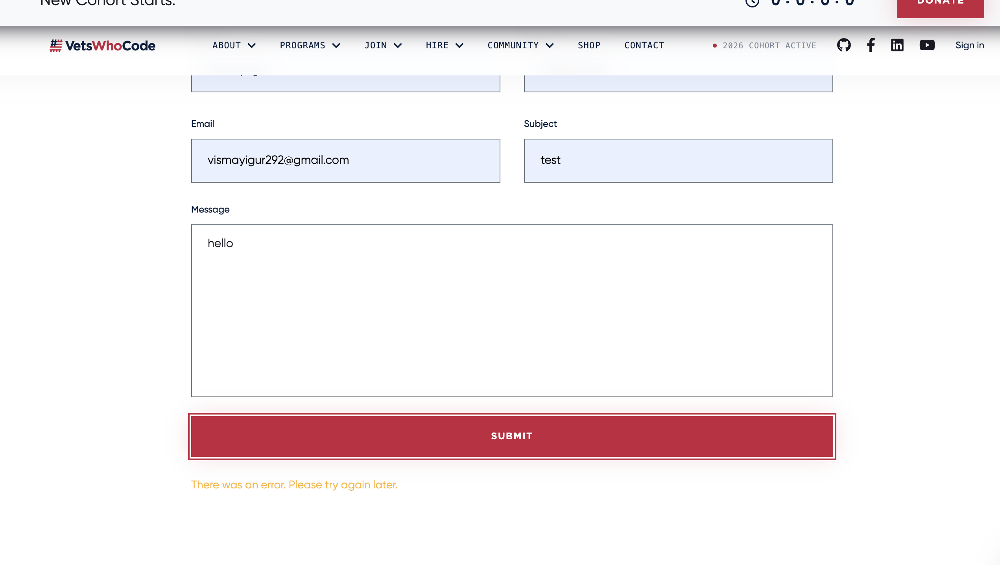

# Contribution 2: Improve error handling in Contact Form

**Contribution Number:** 2  
**Student:** Vismay Igur
**Issue:** https://github.com/Vets-Who-Code/vets-who-code-app/issues/874
**Status:** Phase II Complete

---

## Why I Chose This Issue

I chose this issue because it is a small but meaningful improvement that directly affects the user experience. Clear error messages make an application easier to use and debug, and I liked that this task focuses on making the contact form more reliable rather than simply adding a new feature. It also matches my experience working with React and TypeScript, especially handling frontend logic and thinking about edge cases.

I am also interested in gaining more experience contributing to an existing codebase and understanding how production applications approach error handling. Through this issue, I hope to improve my knowledge of TypeScript error type checking, user-friendly error messages, and production error logging while making a useful contribution to the project.

---

## Understanding the Issue

### Problem Description

The contact form is not showing users the real reason their submission failed. The backend already returns specific error messages for cases like invalid input, short messages, rate limiting, or Slack delivery failure, but the frontend replaces all of them with the same generic fallback message.

### Expected Behavior

When the contact form submission fails, the UI should display the most specific error message available from the backend. For example, if the API returns Message is too short for submission, the user should see that exact message instead of a generic one.

### Current Behavior

Submitting the form in any non-success case causes Axios to throw, and the catch block in the contact form always sets: "There was an error. Please try again later."

So even when the backend gives a helpful error response, that information is lost before it reaches the user.

### Affected Components

- src/components/forms/contact-form.tsx, for the frontend submission and error display logic
- src/pages/api/contact.ts, for the backend validation and error responses

---

## Reproduction Process

### Environment Setup

Setting up the app was super simple. I just needed to clone my fork and run the npm commands given in the repo. I only needed the running local app and browser DevTools to inspect the /api/contact request and confirm the backend was returning a specific error message that the frontend was not displaying.

### Steps to Reproduce

1. Open the local app and navigate to /contact-us.
2. Fill out the form with a valid email and a one-word message such as Hello.
3. Submit the form and watch the POST /api/contact request in DevTools.

Observed result:
The API responds with 400 and the payload includes Message is too short for submission. The UI still shows There was an error. Please try again later.

### Reproduction Evidence

- **Commit showing reproduction:** TBD
- **Screenshots/logs:** 
- **My findings:** 
The backend is behaving correctly and returning specific error details. The bug is in the frontend catch block, which discards the thrown Axios error and always shows the same fallback message.

---

## Solution Approach

### Analysis

The root cause is the catch block in src/components/forms/contact-form.tsx (line 46). Axios throws on non-2xx responses, and the code always replaces the real error with "There was an error. Please try again later." I need to change this to return specified responses.

### Proposed Solution

I will modify the contact form submission handler to inspect Axios errors and surface the backend’s specific error text from error.response.data.message or error.response.data.error, with a generic response set only when no structured message exists. If needed, I’ll also split success and error UI state so error messages render with Feedback state="error".

### Implementation Plan

Using UMPIRE framework (adapted):

**Understand:** 
The contact form is successfully calling the backend, but when the backend returns a specific failure, the frontend hides that detail and always shows the same generic message. The broken behavior is in src/components/forms/contact-form.tsx, inside the onSubmit handler’s catch block at about lines 46-48. axios.post("/api/contact", data) throws on non-2xx responses, and the code currently ignores the thrown error value, meaning backend responses never reach the UI.

**Match:** 
There is already a similar pattern elsewhere in the repo for separating success and error UI that keeps message and errorMessage in separate state and renders success/error feedback independently. There are also backend patterns that inspect Axios errors safely.

Those files show the repo already uses axios.isAxiosError(error) and reads error.response when it needs specific error details.

**Plan:**
1. Update ContactForm to inspect the thrown value in the catch block instead of discarding it as _error.
2. Use axios.isAxiosError(error) to safely check whether the failure came from the API response.
3. If the API returned structured data, read the most useful message from error.response.data, likely message or error.
4. Fall back to the existing generic text only when no specific server message is available.
5. Add or update tests so we prove the form shows backend-provided messages for known failure cases.

**Implement:** 
https://github.com/vismayigur/vets-who-code-app/tree/fix-issue-874

**Review:** 
My self-review checklist will use the repo’s actual tooling and conventions already present in package.json:
- Keep the change minimal and localized.
- Preserve existing success behavior: successful submissions should still show “Thank you for your message!” and trigger emoji rain.
- Follow the repo’s TypeScript and Biome checks.
- Reuse existing Axios error-handling patterns already present in the codebase instead of inventing a new style.
- If a PR/commit convention is required, I’d verify it separately before opening the PR, since it is not documented locally in the files I checked.

**Evaluate:** 
To verify the fix works and nothing else regresses, I would do both manual and automated checks.

Manual verification:
1. Open /contact-us.
2. Submit a valid email with a one-word message like Hello.
3. Confirm the UI now shows Message is too short for submission instead of the generic fallback.
4. Submit with missing required fields and confirm the UI shows the backend validation message.
5. Submit a valid message and confirm the success message and emoji rain still work.

Automated verification:
1. Add/update a component test for src/components/forms/contact-form.tsx that mocks Axios rejection and asserts the rendered feedback shows the server-provided message.
2. Keep the existing API tests in __tests__/pages/api/contact.test.ts, since they already verify the backend returns the specific error payloads we want the frontend to display.

---

## Testing Strategy

### Unit Tests

- [ ] Test case 1: [Description]
- [ ] Test case 2: [Description]
- [ ] Test case 3: [Description]

### Integration Tests

- [ ] Integration scenario 1
- [ ] Integration scenario 2

### Manual Testing

[What you tested manually and results]

---

## Implementation Notes

### Week [X] Progress

[What you built this week, challenges faced, decisions made]

### Week [Y] Progress

[Continue documenting as you work]

### Code Changes

- **Files modified:** [List]
- **Key commits:** [Links to important commits]
- **Approach decisions:** [Why you chose certain approaches]

---

## Pull Request

**PR Link:** [GitHub PR URL when submitted]

**PR Description:** [Draft or final PR description - much of the content above can be adapted]

**Maintainer Feedback:**
- [Date]: [Summary of feedback received]
- [Date]: [How you addressed it]

**Status:** [Awaiting review / Iterating / Approved / Merged]

---

## Learnings & Reflections

### Technical Skills Gained

[What you learned technically]

### Challenges Overcome

[What was hard and how you solved it]

### What I'd Do Differently Next Time

[Reflection on your process]

---

## Resources Used

- [Link to helpful documentation]
- [Tutorial or Stack Overflow post that helped]
- [GitHub issues or discussions that helped]
